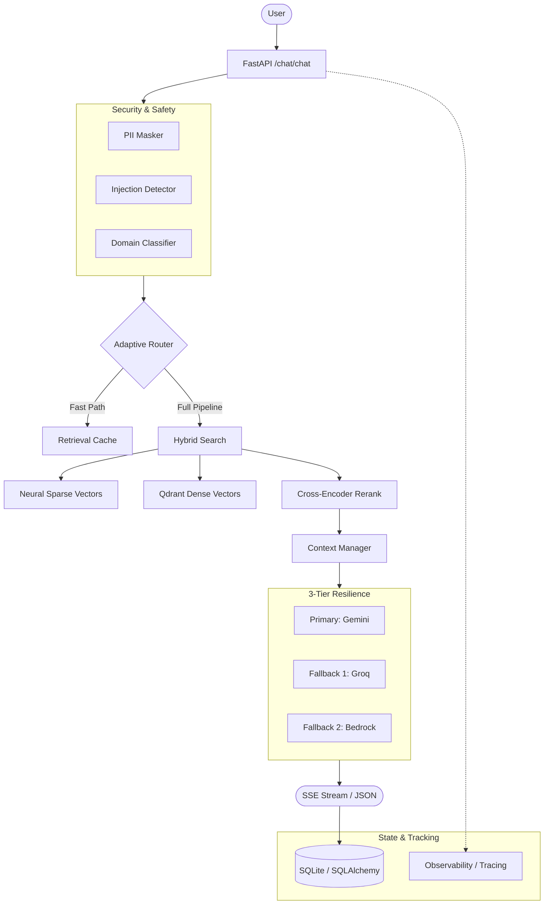

# AI RAG Assistant (Domain-Specific)

A production-ready Retrieval-Augmented Generation (RAG) system with strict domain boundaries, multi-layered security, persistent state, and a resilient multi-tier LLM architecture.

## 🏗️ Architecture Overview

## 🚀 Key Features
*   **Strict Domain Enforcement**: Utilizes a hybrid Keyword + LLM classification to ensure queries remain within the specified knowledge base domain.
*   **Advanced Security**: Multi-stage prompt injection detection including Unicode normalization (homoglyph/zero-width) and decoded content analysis (Base64/Hex).
*   **Triple-Hybrid Search**: Combines semantic meaning (Dense) with neural keyword matching (Qdrant Sparse Vectors/Splade) for industrial-scale precision.
*   **Robust Persistence**: Full conversation history stored in **SQLite** via SQLAlchemy, surviving server restarts.
*   **Real-Time Streaming**: Supports Server-Sent Events (SSE) for "type-writer" style response delivery via `frontend_streaming.py`.
*   **3-Tier Resilience**: Automated fallback between Google, Groq, and AWS via circuit breakers.
*   **Full Observability**: Integrated tracing for every pipeline stage (Security, Retrieval, Generation) with explicit latency tracking.

## 🛠️ Key Design Decisions
1.  **Normalization Before Detection**: We normalize Unicode and homoglyphs *before* running security checks to catch obfuscated injection attempts.
2.  **Dynamic Alpha Tuning**: The system detects if a query is technical (requiring high keyword precision) or conceptual (requiring semantic flexibility) and adjusts retrieval weights (0.3 to 0.8) accordingly.
3.  **SQLite Persistence**: Replaced stateless in-memory stores with a persistent database to support multi-turn conversations and long-term user tracking.
4.  **Async/SSE Pipeline**: The entire stack is built on `asyncio` to support high-concurrency streaming without blocking the event loop.

## ⚖️ Tradeoffs Considered
*   **Latency vs. Accuracy**: We use an `AdaptiveRouter` to bypass heavy re-ranking for simple queries, using the full multi-hop pipeline only for complex informational needs.
*   **Streaming vs. Sync**: While streaming increases complexity, it drastically improves perceived latency by showing thoughts to the user as they occur.
*   **Security vs. Overhead**: Pre-retrieval security checks add ~100-200ms latency but are mandatory for blocking prompt leakage and unauthorized data access.

*   **Single-Instance SQLite**: Designed for single-node deployment. Multi-instance scaling would require moving to a shared DB like PostgreSQL.

## ⚙️ Setup & Installation
1.  **Environment**: `python -m venv venv` && `source venv/bin/activate` (Python 3.10+)
2.  **Dependencies**: `pip install -r requirements.txt`
3.  **Config**: Populate `.env` with your API keys (Gemini, Groq, AWS).
4.  **Ingestion**: `python ingest_docs_simple.py`
5.  **Run Backend**: `uvicorn app.main:app --host 0.0.0.0 --port 8000`
6.  **Run Frontend**: 
    *   **Streaming (Recommended)**: `streamlit run frontend_streaming.py`
    *   Simple: `streamlit run frontend_app.py`

## 📺 Demo Observations
*   **Streaming Response**: Use the `frontend_streaming.py` to see the SSE chunks in action.
*   **Alpha Tuning**: Ask a technical question (e.g., "Python 3.12 syntax") vs. a conceptual one ("Why use Python?") and check backend logs for different `alpha` values.
*   **Security**: Try prompt injections or out-of-domain queries to see the multi-layered blocking in action.
*   **Persistence**: Chat for a while, restart the backend, and refresh the frontend to see your history preserved.
